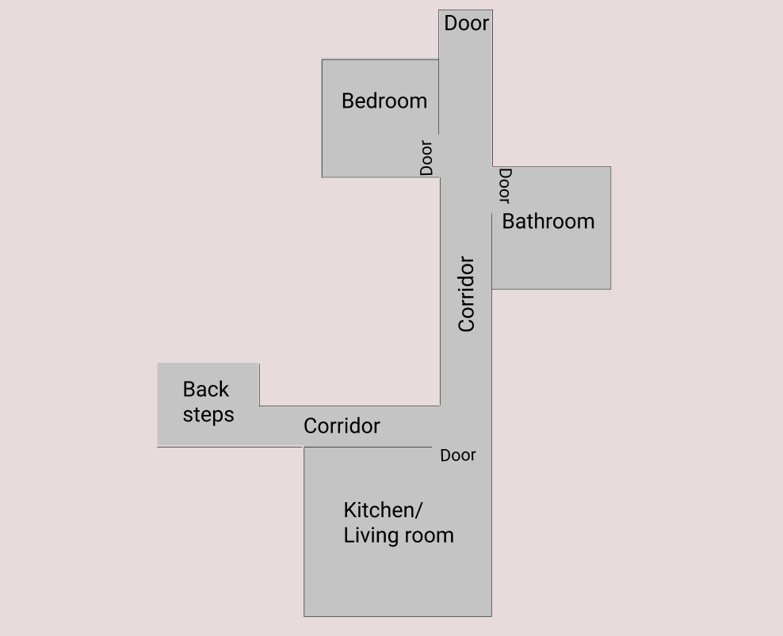

When I originally played Doki Doki literature club I thought the story was about cyberbullying and was a little dissipointed when that wasn't the outcome but it did plant the seeds for another idea.

The root of the idea harks back to when I was in high school and there was a sense of dread about what was happening on myspace and msn messenger after school.

There were times when I would return to school in the morning and feel a tonal shift within friend groups. Sometimes things would be said to me on msn that would shift my perceptions too.

While I no longer worry about this I remember the social fear being just as oppresive as any supernatural horror content.

# A `horror` game about `cyber bullying`

The concept is that a player is mislead through expectation that the `horror` will be supernatual. The player will be expected to be suprised when it is revealed that that the horror is someone being `horrifically cyberbullied online.

While I truly believe there is something great in the idea, the execution is extremely difficult.

My worst fear is that the game will end up as a boring game with an preachy 'edutainment' feel.

Another negative result would be a twee, flavour of the month indie game that targets social issues in a very cliche way.

I am intensely aware that a bad reveal of a 'cyberbullying villain' could even make my toes curl througn my shoes.

I need to find a replacement word for 'bullying' I think.

I think the answer lies in embracing true horror tropes. The distress of the MC is paramount. We need to focus on the existential dread they're experiencing and tell the story through their perspective.

Most important is the emotional attachment you have with the MC. Without this, any subsequent event is irelevant.

A blue sky idea is a have is that there will be an Emily Is Here-like component of game where discussions will be had with online entities who tell conflicting reports on different events.

An example would be two people telling the same story with different facts. This would set up the player to be alienated and suspicious of the other characters in the game.

Depending on how concrete this idea becomes maybe their could be different outcomes dependant on how the player interacts with different characters.

To supplement this maybe there could be a day system and at the beginning on every day there would be a diary page that would inform the player on what happened in the MC's life that day.

Another great idea is that when you open the message window there are previous messages the player hasn't witnessed.

This would further work to alienate the player from interactions in the world making them feel confused and alienated. It could also reveal certain facts about the world without relying on painful exposition.

As far as the horror elements go we could have pop up jump scares on the players computer. Loud, shrill message tones.

Maybe there is a RPG making component and your computer becomes more and more irritating the more distressed you are.

I think the players home would become more and more haunted the more distressing events of the game become like how Silent Hill 4 apartment responds to the story.

## Research material

I would like to replay the letter because I believe the strength of that story is how much you care about the characters. Without this emotional bond noone will care about what is happening to the bullied person.

I feel like Doki Doki leans further into the anime and visual novel tropes then I would like to in my story.

Look into Hypersapce Outlaw.

Build up trust with the cast at first so you don't suspect anything. The bully should be introduced and be non threatening.

The game has an amazing subtly in the way it introduces Sayori's depression. This is done through the poem words she likes and discussions in the classroom.

## Characters

It is hard to identity what aspects the characters will have to be relatable. I think characters should be genderless if possible. Maybe ambiguous names or just screen names.

For inclusivity maybe the gender of the MC is never mentioned.

However I think I need to trigger certain tropes. Players will need to be lulled into a false sense of security.

I have yet to decide whether the setting would be a school enviroment. I would prefer not but if it works, it works.

The player could be in a gang where everyone has nicknames. For gender pronouns we could just go they/them and keep it neutral.

## Gameplay

Gameplay needs to be non obtrusive. Any gameplay needs to improve the experience, not frustrate the player. No gameplay for gameplay sake. There will be some choices but no choices for the sake of choice.

If the question is ever between gameplay or narrative. Narrative wins.

## Setting

It would make the most sense for the story to be in a high school in America or Japan or somewhere vague but similar. Ambiguous would be ideal.

## Story Arc

The story must be short and punchy. At no point should the player be wondering how much longer the game goes for. Quality over quantity. This also works as I actually want to finish this project.

There could be a paranormal club that characters are a part of. The bully or bullies could also be involved.

This could work to lull the players into suspicions about the supernatural. Maybe this could be a gang investigating haunted spots/cult locations/govermental conspiracies.

The arc should be like this

- We are introduced to MC. This is be short as it is less important who they are, they are more of a vessel for the player.

My idea is that the game would begin with a diary entry. This would only briefly introduce the character, it would not go out of it's way to give them any backstory.

- We introduce horror tropes to confuse the player. I think the victim should be facinated by horror too.

This could be things like I mentioned early eg: bugs on the screen, shrill noises, twisted words.

This feeds into my idea of supernatural/cult/conspiracies

- Contridicting but hinting events happen related to bullying. Possibly there is a choice that if made by the MC will speed up the reveal.

I think now that there will be multiple situations based on choices chosen by the MC.

- There is a big emotional reveal about the bullying. This will be hard to achieve without seeming like an after school special or a PSA.

To avoid that I think it will have to appear as genuine horror until the moment of reveal.

- There will be some kind of confrontation. The resolution will be positive.

Not sure about this anymore.

There will need to be a serious warning at the start of the game. I think the less terrifying the subject material the less I will have to spoil for the player.

Not entirely sure about this.

## Mockup

Game begins with a diary entry. This entry will include a brief mention of all the key players and their actions.

From here I think the perspective pivots to an RPG maker like display. The character will be controlled by the chracter to get a coffee and then the computer will blip alerting the player to a message.

I think objects in the house will be interactable. Maybe rooms will become unlocked for specific actions. Maybe rooms will be unlocked on certain days as well unlocking clues at the right time.

Once you use the computer you will have access to their computer operating system. There will definetly be a messaging system. BE CAREFUL NOT TO MIMIC EMILY TOO MUCH.

I think either you exhaust all the options on the chat and the MC automatically go's to sleep or you choose to go to bed yourself.

The next day repeats a similar format. It doesn't neccesarily have to be the next day either, in fact I think a couple of days would make more sense to make the player feel more alienated.

Sprinkled in could be actions by the MC and various group members that could both work as backstory and red herrings.

Maybe there could be an occult red herring subplot. Distracting the player from what's happening is absolutely paramount

Eventually the players house will become more and more haunted. Rooms may change, the layout may change, interactions may change.

I think there should be an 'insanity meter'. This is ussualy quite played out so if we went that way I think it would suggested by the events happening on screen, not a static bar.

I am lost at this stage. Maybe the player could play detective and solve the problem but what would the lose state be. I'm not happy with any lose states being death or suicide. I would only consider this as a 'bad ending' and would be hard or intentional to get.

I guess a lose state could be the bully getting away with it.

This would feed into an almost Nier Automata/Doki Doki-like structure where maybe there is multiple playthroughs and more is revealed every time.

The true ending would be exposing the bully.

## Game Development tools

Originally it was RPG maker but I need to find something between simiplicity and upgradability. The game development tools should be simple enough to mock up my game with little or no effort. The game doesn't need fancy gameplay or visuals.

## Blockers

- Diving in and writing a script structure.
- Balancing this work with my internship with Manna
- Possibly giving up at the first hurdle
- Becoming self concicious about the material.

7 days

6 characters

1 option to isolate

## Session two:

Build the house

Make a floorplan in figma

